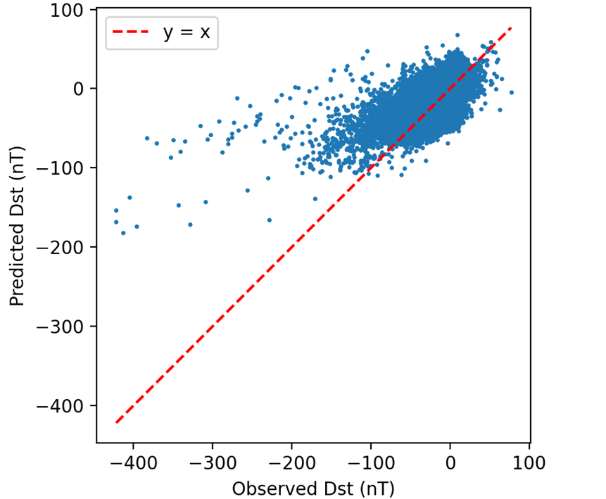
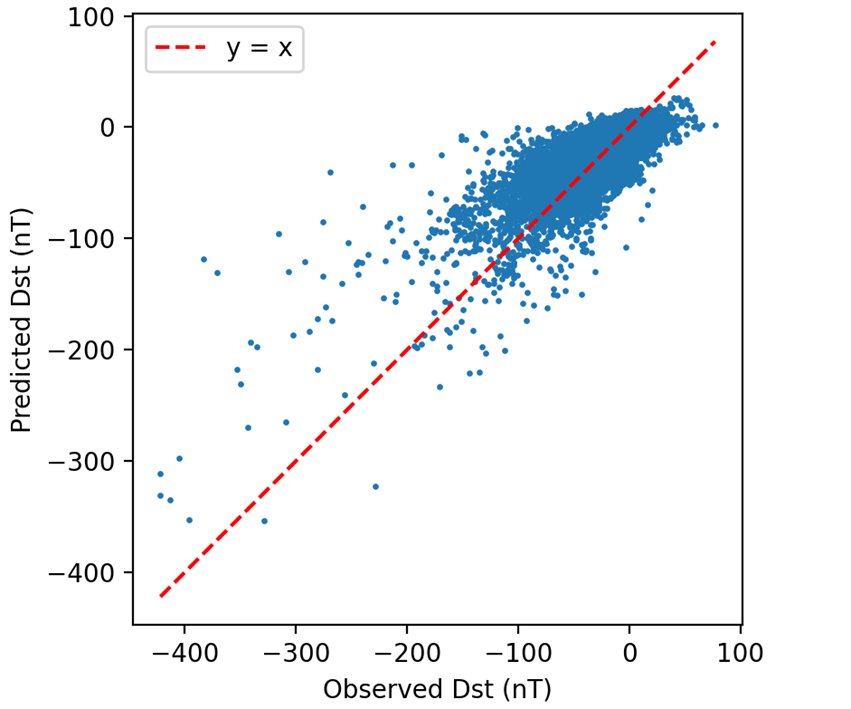

# Predicting the Severity of Geomagnetic Storms using Machine Learning

## Project summary

This project develops and evaluates machine learning models for short term forecasting of the severity of geomagnetic storms using the Disturbance Storm Time (Dst) index. A baseline linear regression model and a double branch convolutional neural network (CNN) are trained on solar wind and sunspot time series data to predict the Dst index one and five hours into the future. The final CNN model outperforms NOAA’s benchmark LSTM model on one hour ahead Dst predictions.

---

## Problem definition

Geomagnetic storms pose a risk to satellites, power grids, and communication systems. Accurate short term forecasting of storm intensity, commonly measured using the Dst index, is therefore an important space weather prediction task. This project focuses on predicting future Dst values using upstream solar wind and sunspot observations.

---

## Data sources

Solar wind measurements are collected upstream of Earth at the Sun–Earth L1 Lagrange point, providing advance information on solar wind conditions before they interact with the magnetosphere. These upstream observations are used as model inputs.

The target variable, the Disturbance Storm Time (Dst) index, is derived from ground based measurements and represents the global state of geomagnetic activity. Sunspot data is included as an additional input feature to capture longer term solar activity.

---

## Models Used

Two modelling approaches are explored. A baseline linear regression model and a convolutional neural network model.

### Why CNN over LSTM?

CNNs were selected over LSTMs based on literature demonstrating comparable 
predictive performance at significantly lower parameter counts and training 
times. [Li and Sun (2024)](https://ieeexplore.ieee.org/document/10934347/) 
found that a TD-CNN trained in only 17.8% of the time required by a 
comparable Bi-LSTM on the same Dst forecasting task. Separately, results 
from the MagNet competition [(Licata et al., 2023)](https://doi.org/10.1029/2023SW003514) 
show a CNN ensemble matching LSTM-GRU accuracy with less than 0.1% of the 
parameter count (51,191 vs 60 million).

---

## Hyperparameter Optimization

### 1. Initial Model
After refining an initial CNN model, the model layout prior to hyperparameter optmisation was the following:

| Layer No. | Layer Type | Info |
| :--- | :--- | :--- |
| **1** | Input | - |
| **2** | CNN | - |
| **3** | CNN | Same parameters as 1st CNN layer |
| **4** | CNN | Double the parameters as previous CNN layers |
| **5** | Global Average Pooling | - |
| **6** | Dense | No. of units tied to final CNN layer no. of filters |
| **7** | Output | - |

This approach was taken to reduce the search space during hyperparameter optimisation.

### 2. Initial Model Random Search Results (Top 10 Configurations)
The following table summarizes the performance of the top 10 configurations during the initial hyperparameter search, evaluated by the normalised validation MSE loss.

| Rank | No. of Filters | Kernel Size | Strides | Learning Rate | Val Loss |
| :--- | :--- | :--- | :--- | :--- | :--- |
| 1 | 60 | 7 | 2 | 0.0002 | **0.83552** |
| 2 | 80 | 7 | 2 | 0.0002 | 0.84879 |
| 3 | 40 | 10 | 2 | 0.0004 | 0.84945 |
| 4 | 40 | 7 | 2 | 0.0003 | 0.84977 |
| 5 | 20 | 10 | 2 | 0.0008 | 0.85511 |
| 6 | 100 | 7 | 2 | 0.0001 | 0.85907 |
| 7 | 40 | 10 | 2 | 0.0005 | 0.86009 |
| 8 | 60 | 10 | 2 | 0.0007 | 0.86739 |
| 9 | 100 | 10 | 2 | 0.0006 | 0.87039 |
| 10 | 20 | 10 | 2 | 0.0007 | 0.87054 |

From these results it was clear that both kernel sizes of 7 and 10 were very effective, alongside a stride length of 2.

### 3.  Double Branch CNN Model

From the results of the initial hyperparameter optmisation, a **Double Branch CNN** model architecture was investigated. This was to allow the model to process data through the two different effective kernel sizes simultaneously.

| Layer No. | Layer Type | Info |
| :--- | :--- | :--- |
| **1** | Input | - |
| **2** | CNN | **Branch A:**  kernel = 7, stride = 2   **Branch B:** kernel = 10, stride = 2 |
| **3** | CNN | **Branch A:** kernel = 7, stride = 2   **Branch B:** kernel = 10, stride = 2 |
| **4** | CNN | **Branch A:** kernel = 14, stride = 4   **Branch B:** kernel = 20, stride = 4 |
| **5** | Global Average Pooling | **Branch A:** -   **Branch B:** -|
| **6** | Concatenate | Combine output of both branches |
| **7** | Dense | - |
| **8** | Output | - |

### 4. Double Branch CNN Model Random Search Results (Top 10 Configurations)

The table below summarizes the top 10 configurations found during the second stage of hyperparameter optimization. The shift to a dual-branch architecture led to a significant performance improvement.

| Rank | No. of Filters | Learning Rate | Val Loss |
| :--- | :--- | :--- | :--- |
| **1** | **20** | **0.0007** | **0.74791** |
| 2 | 20 | 0.0006 | 0.76245 |
| 3 | 40 | 0.0005 | 0.77597 |
| 4 | 100 | 0.0003 | 0.78015 |
| 5 | 20 | 0.0005 | 0.78110 |
| 6 | 20 | 0.0009 | 0.78552 |
| 7 | 20 | 0.0008 | 0.78562 |
| 8 | 40 | 0.0006 | 0.78974 |
| 9 | 100 | 0.0007 | 0.79757 |
| 10 | 40 | 0.0009 | 0.81496 |

These results showed that adopting a multi-branch model decreased the validation loss by just over 10% which is a huge gain.

### 5. Final Model

| Layer No. | Layer Type | Info |
| :--- | :--- | :--- |
| **1** | Input | - |
| **2** | CNN | **Branch A:** filters = 20, kernel = 7, stride = 2   **Branch B:** filters = 20, kernel = 10, stride = 2 |
| **3** | CNN | **Branch A:** filters = 20, kernel = 7, stride = 2   **Branch B:** filters = 20, kernel = 10, stride = 2 |
| **4** | CNN | **Branch A:** filters = 40, kernel = 14, stride = 4   **Branch B:** filters = 40, kernel = 20, stride = 4 |
| **5** | Global Average Pooling | **Branch A:** -   **Branch B:** -|
| **6** | Concatenate | Combine output of both branches |
| **7** | Dense | 40 units |
| **8** | Output | - |

---

## Training and evaluation

Model development follows a structured pipeline:

* Preprocessing of training and test datasets
* Two stage hyperparameter optimisation for the CNN
* Final model training on the entire training dataset using the optimal hyperparameters
* Evaluation on test data

Performance is assessed using root mean squared error (RMSE) on one hour and five hour ahead predictions.

---

## Results

The final linear and CNN models achieve the following performance on one hour ahead Dst predictions:

* Linear RMSE: **17.48 nT**
* CNN RMSE: **13.71 nT**
* NOAA benchmark LSTM RMSE: **[15.2 nT](https://agupubs.onlinelibrary.wiley.com/doi/10.1029/2023SW003514#:~:text=Progress%20of%20the%20best%20scores%20(root%20mean%20square%20error%2C%20the%20lower%20the%20better)%20on%20public%20and%20private%20leaderboards%20over%20the%20course%20of%20the%20competition.%20Benchmark%20model%20achieved%20an%20root%20mean%20square%20error%C2%A0of%2015.2%C2%A0nT%20on%20the%20private%20leaderboard%20and%2016.3%20on%20the%20public%20leaderboard.)**

This CNN model represents a clear improvement over the linear and benchmark models.

### Model Accuracy Visualization
The following scatter plot illustrates the relationship between predicted and observed Dst values. There is a clear difference between the linear and non-linear model predictions for the more intense storms which are characterised by a more negative Dst value.

*Linear model predictions versus observed Dst values on test dataset for the one-hour-ahead forecast.*

*Non-Linear model predictions versus observed Dst values on test dataset for the one-hour-ahead forecast.*

---

## Repository structure

* `Preprocess_Train.py`
  Preprocessing for the training data

* `Preprocess_Test.py`
  Preprocessing for the test data

* `Tune_1st_Stage.py`
  Initial hyperparameter optimisation for the CNN model

* `Tune_2nd_Stage.py`
  Refined hyperparameter optimisation based on first stage results

* `Final_Train.py`
  Final model training and validation

* `Test.py`
  Evaluation on test data

---

## How to run

To reproduce the final trained model and evaluation results, only the final training script needs to be executed.

### Data placement

Ensure the input data is organised as follows:

* Place all training data files inside a folder named `train`

* Place all test data files inside a folder named `test`

Both the train and test folders must be located in the same directory as the Python scripts.

### Execution steps

1. Run `Preprocess_Train.py` and `Preprocess_Test.py` to generate processed datasets

2. Run `Final_Train.py` to train the linear and final CNN model and save the resulting `.keras` model file

3. Run `Test.py` to evaluate model performance using the saved linear and CNN models

The `Tune_1st_Stage.py` and `Tune_2nd_Stage.py` scripts are provided for reference only. They document the hyperparameter exploration process that informed the final CNN model configuration and are not required to reproduce the reported results.

---

## Tools and techniques

* Python
* Pandas and Numpy
* Keras and KerasTuner
* Time series forecasting
* Convolutional neural networks
* Hyperparameter optimisation

---

## Data and challenge sources

* [MagNet: Model the Geomagnetic Field](https://www.drivendata.org/competitions/73/noaa-magnetic-forecasting/)
* [MagNet—A Data-Science Competition to Predict Disturbance Storm-Time Index (Dst) From Solar Wind Data](https://doi.org/10.1029/2023SW003514)

---

## Background reading
* [Chollet F *Deep Learning with Python*, Third Edition, Manning Publications](https://www.manning.com/books/deep-learning-with-python-third-edition)
